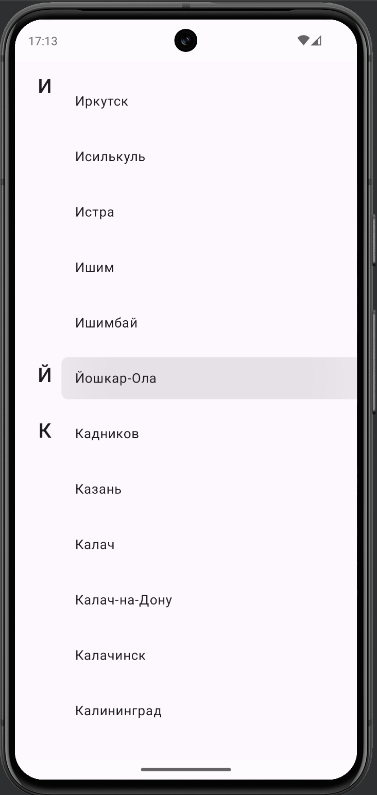
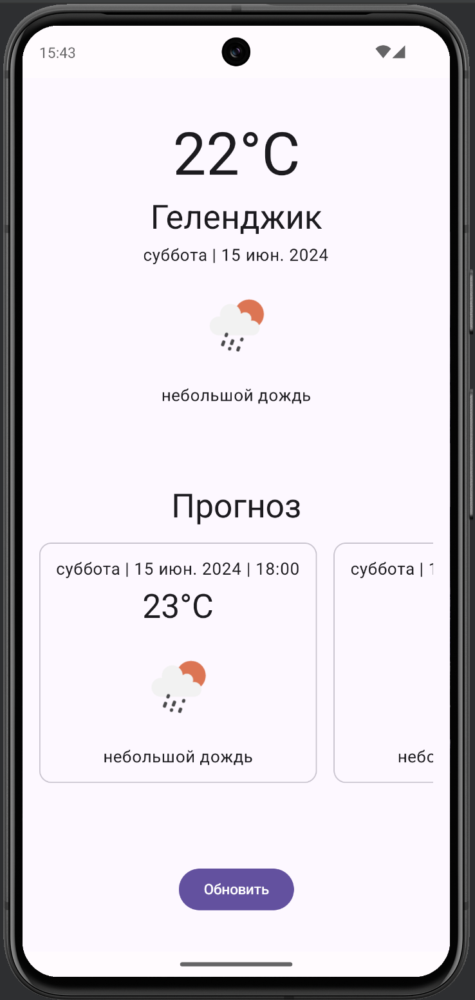
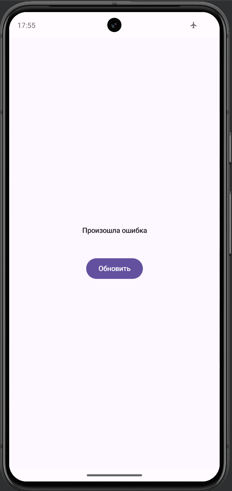

# GazpromTestWeather

GazpromTestWeather - это приложение для просмотра текущей погоды и прогноза в различных городах. Данные о погоде предоставляются через API [OpenWeather](https://openweathermap.org)

## Экраны

### 1. Список городов

<div style="overflow: auto;">
  
</div>

На этом экране отображается список городов. Реализована функция sticky labels для удобной навигации. Пользователь может выбрать любой город, чтобы узнать информацию о погоде в этом городе

### 2. Погода в городе

<div style="overflow: auto;">
  
</div>

После выбора города из списка, пользователь переходит на экран с подробной информацией о текущей погоде и прогнозом. Здесь отображается погода в настоящий момент времени и прогноз, включающие в себя температуру, иконку погоды, описание и время

### 3. Обработка ошибок

<div style="overflow: auto;">
  
</div>

В приложении также реализована корректная обработка сетевых ошибок, пользователю доступна возможность сделать повторный запрос

## Стек технологий

Приложение разработано с использованием следующих технологий:

- **Jetpack Compose** - для отрисовки UI
- **MVIKotlin** - для реализации архитектурного паттерна
- **Decompose** - для разбиения на компоненты и навигации между ними
- **Retrofit** - для выполнения сетевых запросов
- **Coroutines** - для асинхронного программирования
- **Glide** - для асинхронного отображения картинок из интернета
- **Dagger** - для инъекции зависимостей

## Запуск приложения

Для запуска приложения, убедитесь, что ваше устройство удовлетворяет следующим требованиям:

- Android-устройство с версией ОС Android 10.0 (API 29) или выше.

## Настройка API Key

В файл ```gradle.properties``` необходимо добавить Api Key в следующем формате:

```properties
apikey=YOUR_API_KEY
```

Получить ключ можно на сайте [OpenWeather](https://www.weatherapi.com)
